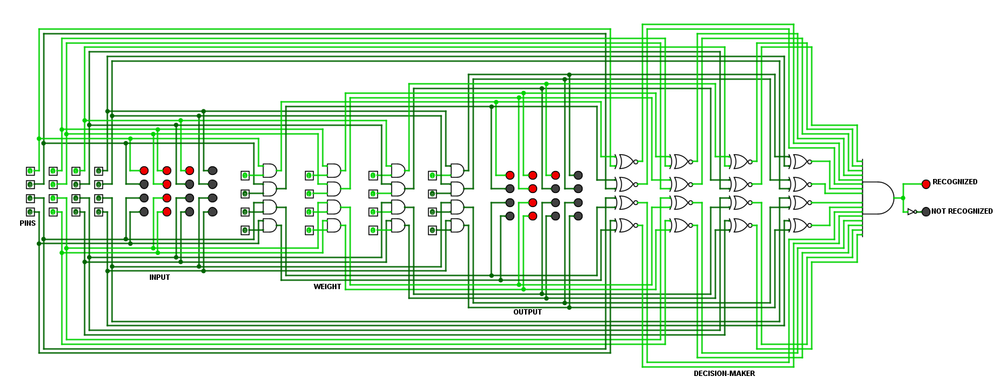

# ✨ Detector-V0.0
- A primitive and configurable pattern detector made using logic gates to implement weight array and decision making.

  

  Detector recognizes alphabet T

## Weight Array
- It is a 4×4 array used to configure the machine for detection of a particular pattern.
- It acts as a filter, and only allows the input to the output side only if the corresponding weight is 1/High and don't allow the rest.
- Wrc is the weight array element, where 4&ge;r&le;0 and 4&ge;c&le;0
